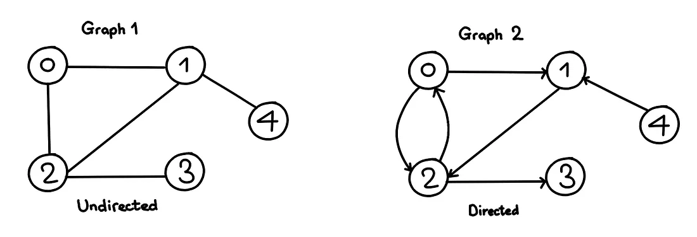

# Graphs 

A graph is a data structure that consists of the following two components:

1. A finite set of vertices also called as nodes.
2.  


1. Graph Representation

    - [Adjacency Matrix](#adjacency-matrix)
    - [Adjacency List](#adjacency-list)
    - [Edge List](#edge-list)


2. Graph Traversal

    - [Depth First Search (DFS)](#depth-first-search-dfs)
    - [Breadth First Search (BFS)](#breadth-first-search-bfs)


3. Shortest Path Algorithms

    - [Dijkstra's Algorithm](#dijkstras-algorithm)
    - [Bellman-Ford Algorithm](#bellman-ford-algorithm)
    - [Floyd-Warshall Algorithm](#floyd-warshall-algorithm)

# Graph Used in this Tutorial

We will use the following graph for our examples:

```
    0 -- 1
    |  /   \
    | /     \   
    2 -- 3   4
```


## [Adjacency Matrix](#adjacency-matrix)

An adjacency matrix is a 2D array of size `V x V` where `V` is the number of vertices in a graph. Let the 2D array be `adj[][]

- `adj[i][j] = 1` when there is an edge from vertex `i` to vertex `j`, otherwise `adj[i][j] = 0`.


```Python
# Python program to create an adjacency matrix

edges = [[0,1],[0,2],[1,2],[1,4],[2,3]]

t = [0]*len(edges)
adj_matrix = [t for i in range(len(edges))]
for u,v in edges:
    adj_matrix[u][v] =1

for row in adj_matrix:
    print(row)

```
```
Adjacency Matrix:

[0, 1, 1, 1, 1]
[0, 1, 1, 1, 1]
[0, 1, 1, 1, 1]
[0, 1, 1, 1, 1]
[0, 1, 1, 1, 1]

```

## [Adjacency List](#adjacency-list)

An adjacency list represents a graph as an array of linked lists.

The index of the array represents a vertex and each element in its linked list represents the other vertices that form an edge with the vertex.

```Python
# Python program to create an adjacency list

edges = [[0,1],[0,2],[1,2],[1,4],[2,3]]

      
adj_list = defaultdict(list)
for u,v in edges:
    adj_list[u].append(v)

for k,v in adj_list.items():
    print(k,v)
```

```
Adjacency List:

0 [1, 2]
1 [2, 4]
2 [3]
```


## [Edge List](#edge-list)

An edge list is a list of all the edges in a graph.

```Python
# Python program to create an edge list

edges = [[0,1],[0,2],[1,2],[1,4],[2,3]]

for u,v in edges:
    print(u,v)
```

```
Edge List:

0 1
0 2
1 2
1 4
2 3
```

## [Depth First Search (DFS)](#depth-first-search-dfs)

Depth First Search (DFS) is a graph traversal algorithm where we traverse the graph by going as deep as possible and backtrack once we reach a vertex with no neighbors to visit.

```Python
# Python program to perform Depth First Search Recursive

seen = set()
def dfs(node):
    if node not in seen:
        seen.add(node)
        print(node)
        for neighbour in adj_list[node]:
            dfs(neighbour)
      
dfs(0)

# Output: 0 1 2 3 4
```

```Python
# Python program to perform Depth first search Iteratively

def dfs_iter(node):
    seen = set()
    stack = [node]
    while stack:
        if (item:=stack.pop()) not in seen:
            seen.add(item)
            print(item)
            for vertex in adj_list[item]:
                stack.append(vertex)
dfs_iter(0)

# Output: 0 2 3 1 4
```

## [Breadth First Search (BFS)](#breadth-first-search-bfs)

Breadth First Search (BFS) is a graph traversal algorithm where we traverse the graph by exploring all the neighbors of a vertex before moving on to the next level of neighbors.

```Python
# Python program to perform Breadth First Search

def bfs(node):
    q = deque()
    q.append(node)
    seen = set()
    while q:
        item = q.popleft()
        if item not in seen:
            print(item)
            seen.add(item)
            for vertex in adj_list[item]:
                q.append(vertex)
bfs(0)

# Output: 0 1 2 4 3
```


